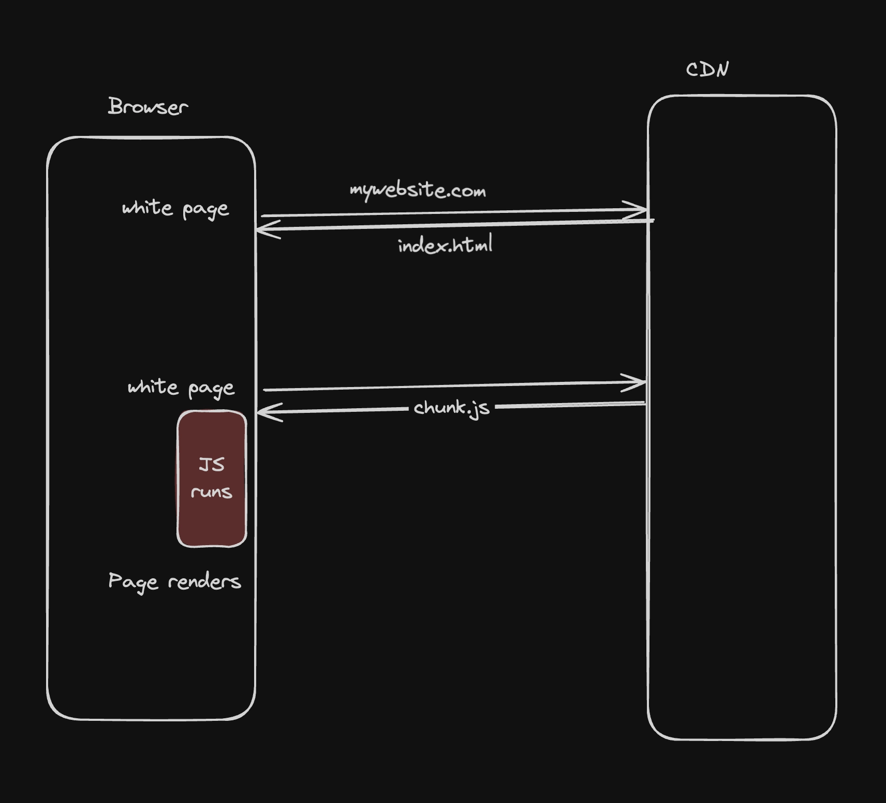
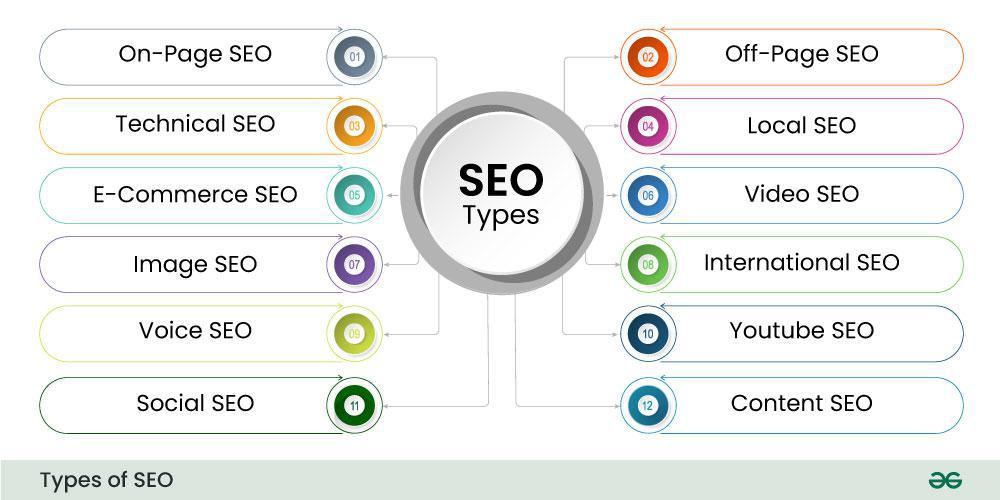

## Client Side Rendering

Client-side rendering (CSR) is a modern technique used in web development where the rendering of a webpage is performed in the browser using JavaScript. Instead of the server sending a fully rendered HTML page to the client

notice here how the initial HTML file doesnt have any content

This means that the JS runs and actually populates / renders the contents on the page

React (or CSR) makes your life as a developer easy. You write components, JS renders them to the DOM.

## Downsides?

1. Not SEO optimised
2. User sees a flash before the page renders
3. Waterfalling problem

### What is SEO optimized

Search Engine Optimization (SEO) is the art and science of getting your website to rank higher on Google, Bing, and other search engines without paying for ads. In 2025, SEO drives 93% of all online experiences and generates 10x more traffic than social media combined.

The higher your pages appear in search results, the greater the chance they are discovered and clicked on.

### Basic components of SEO

#### 1. On-Page SEO
Optimizing content and HTML elements on a webpage (keywords, headings, meta tags) to improve rankings.

#### 2. Off-Page SEO
Activities outside your website (like backlinks and brand mentions) to increase authority and trust.

#### 3. Technical SEO
Improving website infrastructure (speed, indexing, crawlability, mobile-friendliness) for better search engine access.

#### 4. Local SEO
Optimizing a business to appear in location-based search results (e.g., Google Maps, “near me” searches).

#### 5. E-Commerce SEO
Optimizing online store pages (products, categories) to increase visibility and sales from search engines.

#### 6. Video SEO
Optimizing videos (titles, descriptions, tags) to rank higher in video search results.

#### 7. Image SEO
Optimizing images (alt text, file names, size) to improve visibility in image search.

 #### 8. International SEO
Optimizing a website to target users in different countries or languages.

#### 9. Voice SEO
Optimizing content for voice search queries, usually conversational and question-based.

#### 10. YouTube SEO
Optimizing videos specifically to rank higher on YouTube search results.

#### 11. Social SEO
Using social media signals and content to improve visibility and traffic from search engines.

#### 12. Content SEO
Creating and optimizing valuable, relevant content to rank higher and attract organic traffic.

## Types of SEO Techniques

### 1. Black-Hat SEO

#### 1. Use of Paid Links
Buying backlinks to manipulate search engine rankings.
#### 2. Hidden Text
Placing invisible text (same color as background or off-screen) to stuff keywords.
#### 3. Article Spinning
Rewriting existing content automatically to create multiple similar versions.
#### 4. Cloaking
Showing different content to search engines than what users actually see.
#### 5. Keyword Stuffing
Overloading a page with excessive keywords to rank higher.

#### 6. Duplicate Content
Using identical or very similar content across multiple pages or sites.
#### 7. Link Farming
Creating or joining networks of websites that link to each other to boost rankings.
#### 8. Content Farming
Producing large amounts of low-quality content just to attract traffic.

### 2. White-Hat SEO

#### 1. Keyword Research
Finding relevant and valuable search terms that users commonly search for.

#### 2. Relevant Content and Links
Creating high-quality content and earning natural links that match user intent.

#### 3. Well-Labeled Images
Using proper file names, alt text, and descriptions to make images searchable.

#### 4. Linking from Relevant Sources
Getting backlinks from trustworthy and industry-related websites.

#### 5. Good Grammar and Complete Sentences
Writing clear, correct, and user-friendly content for better readability and trust.

## Waterfalling Problem

