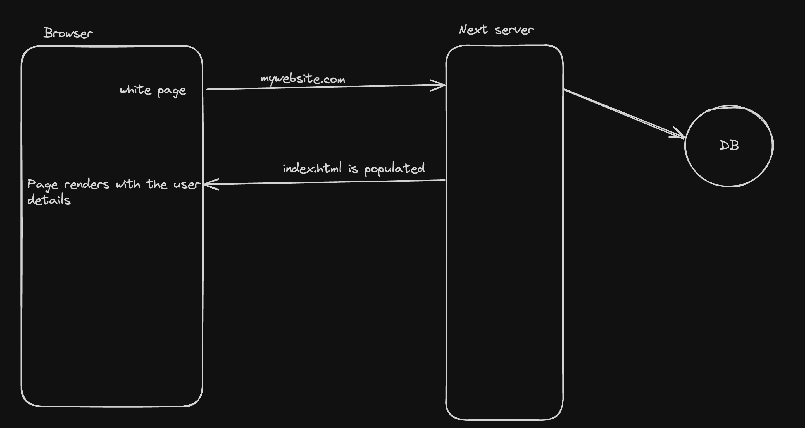

## Server Side Rendering

When the rendering process (converting JS components to HTML) happens on the server, it’s called SSR. 

### Why SSR?

1. SEO Optimisations
2. Gets rid of the waterfalling problem
3. No white flash before you see content

Notice the initial HTML page is populated 

### Downsides of SSR?
1. Expensive since every request needs to render on the server
2. Harder to scale, you can’t cache to CDNs

